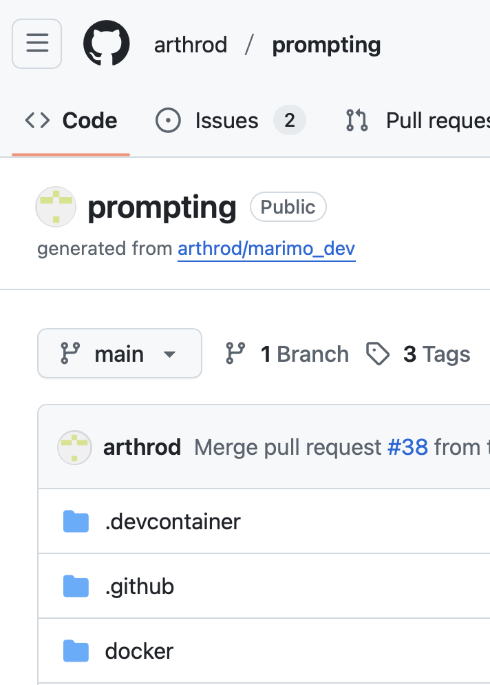
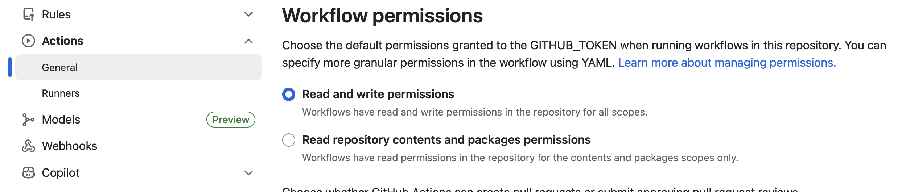

# Spotify and CI

## Background

We started this session with a look at the
[Prompting for Attorneys](https://huggingface.co/spaces/arthrod/prompting_for_attorneys)
app on Hugging Face.

Behind every good app, there is a GitHub repository, and so we explored the
[GitHub repo](https://github.com/arthrod/prompting/) behind this one. We noticed
these directories:

* `.devcontainer`, which is a configuration space for preparing Codespaces
* `.github/workflows`, which is a configuration space for *GitHub Actions*, a form of *Continuous Integration*
* `docker`, which holds a *Dockerfile* - the configuration for *containerising* an application



## Spotify EDA

This repository contains a Marimo notebook from a series on Polars, from
[the Marimo team](https://github.com/marimo-team/learn/tree/main/polars). The notebook
uses some Spotify tracks data to demonstrate Polars functionality and take the learner
through some exploratory data analysis (EDA) techniques.

You can run this notebook like an app, like this:

```bash
uv run marimo run notebooks/spotify_eda.py
```

## Dev Container Configuration

Devcontainers allow you to define a consistent development environment.
Codespaces will always look for and use a devcontainer config, but you
can also use devcontainers in your local VS Code.

This repo contains a `devcontainer.json` that installs `uv` with a *feature*,
installs the VS Code `Python` extension with *customizations* and calls the
*postCreateCommand* to `sync` the environment, so you don't have to.

## GitHub Action Configuration

GitHub Actions are a way to run continuous integration (CI) workflows,
or automated processes triggered by updates to your repository code.
These processes run on virtual GitHub servers called runners.

This repo contains a workflow configuration in
`.github/workflows/python_app.yaml` that runs on pushes to the `main` branch.

On a repository without any GitHub Actions configured, some templates are
provided to help you get started. We've used the `Python application` template,
which sets up a workflow to:
* Check out the repository code
* Set up Python
* Install dependencies
* Run tests and checks

Unfortunately, the workflow is incomplete and doesn't use very modern tooling. For
example it uses `pip` to install dependencies, rather than `uv`.

To use `uv` in the workflow, we know we first need to install it. For most common
CI tasks, a GitHub Action worklow already exists. Installing `uv` is one of these
common tasks, so we might think about searching the
[GitHub Actions Marketplace](https://github.com/marketplace?type=actions) for a
suitable "uv" workflow. Look for the official one and use the examples within.

### Exercise

Next, have a look at the rest of the workflow file and complete the TODOs that are
listed within it.

**I'd recommend snoozing GitHub Copilot and having a go yourself first!**

### Triggering GitHub Actions

First, commit and push any changes to the workflow configuration to GitHub. This
should trigger the workflow run, which you can monitor from the repository page
on GitHub, under the `Actions` tab.

Are there any issues? If so, you would come back to the Codespace to fix them and
push again until the workflow runs successfully.

Let's now make some changes to the notebook itself.

### Exercises

* Add type hints to the utility function in the Notebook.
    - You can add type hints to arguments, and to the return type.
* Add a test for the utility function in `tests/test_utility.py`.
    - You may overwrite the existing placeholder test function.

**Feel encouraged to use GitHub Copilot to guide the way.**

## Docker Configuration

Docker is a platform for developing, sharing, and running applications. It
uses containerisation technology to package an application and its dependencies.

It aims to solve the problem of "it works on my machine" by providing a consistent
environment from development to production. Many cloud platforms support Docker
containers natively, so they are a great way to package applications for deployment.

This repo contains a Dockerfile in the project root that builds a Docker image
for the app. Have a look! We choose a base image, install `uv`, copy over all the
important project files, `sync` the environment, expose a port and define a command to run
the app.

### Triggering a Docker Build

We can use continuous integration to build and push Docker images too. 
First we have to enable the appropriate permissions on our repository, via
Settings:



Now let's add a new GitHub Action to do this. Building Docker images is another
common task, so we might go back to the
[GitHub Actions Marketplace](https://github.com/marketplace?type=actions) for a
suitable "Docker" workflow.

We can see the *Build and push Docker images* action and the examples within
to create a new workflow for ourselves. You can copy the `container.yaml` file
from the `complete/` directory in this Codespace, or create your own from scratch.

Once copied in, commit and push the changes to GitHub to trigger the workflow.
We'll look at using this Docker image in the next session.

Note that we added these permissions:

```yaml
permissions:
  contents: read
  packages: write
```


# The End!